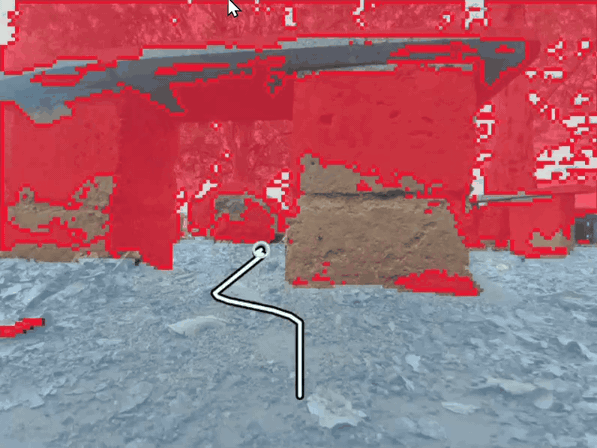
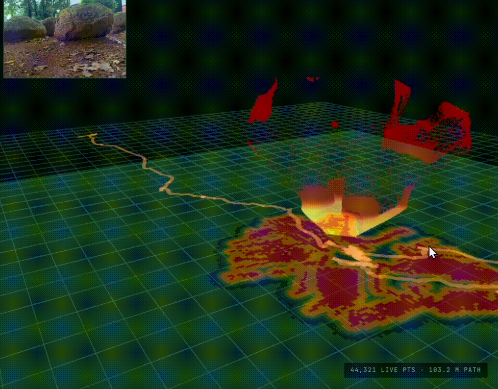
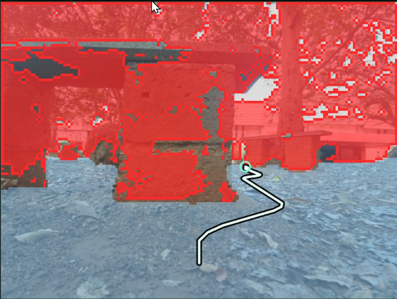
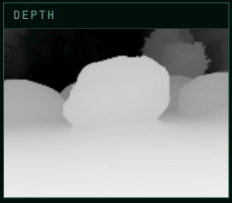
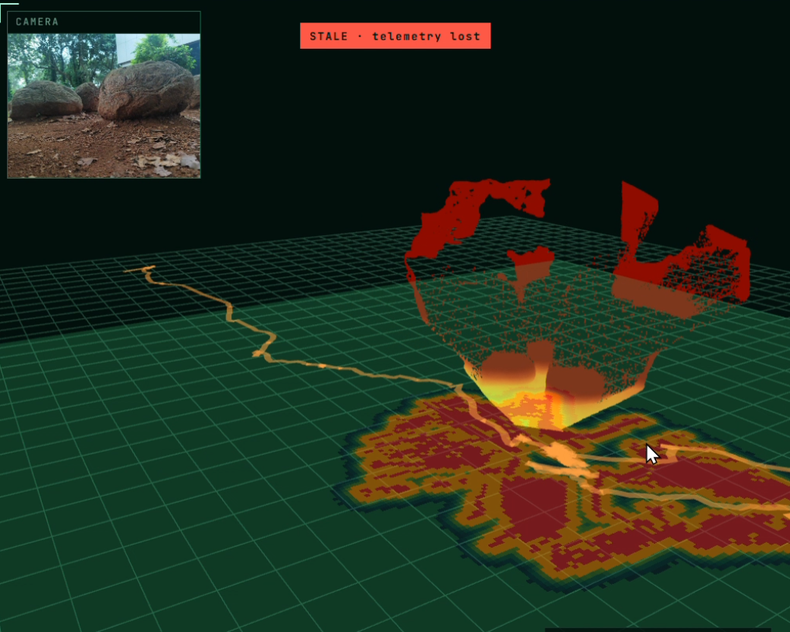
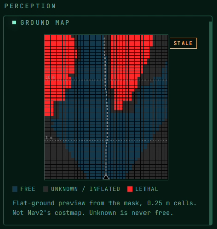
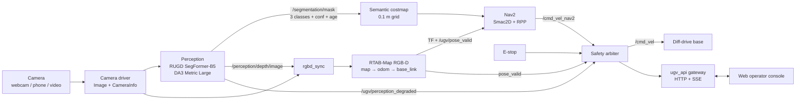
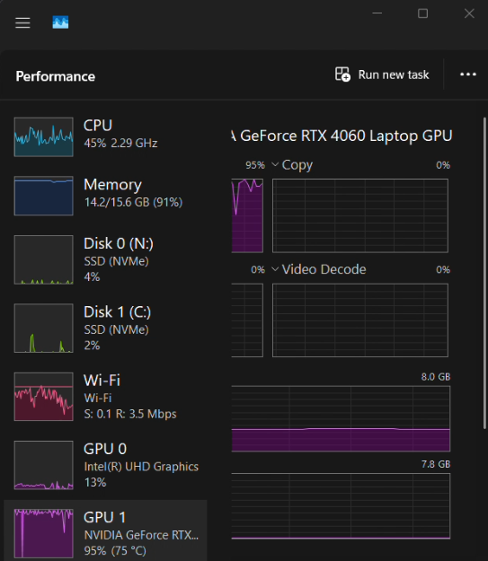

<div align="center">

# whoami

### Camera-primary autonomous navigation for GPS-denied outdoor UGVs

*Point A to Point B with no GPS, where the vision model is a pluggable sensor and never the brain.*

[](#test-setup)

[](https://docs.ros.org/)
[](https://docs.nav2.org/)
[](https://introlab.github.io/rtabmap/)
[](https://pytorch.org/)
[](https://docs.openvino.ai/)
[](ui/)
[](#status)

&nbsp;

*Left: live camera with the Perception Port drawn over it. Right: the live depth scan as a rolling 3-D height map, RTAB - cost map.*

</div>

---
## Contents

- [At a glance](#at-a-glance)
- [Demo](#demo)
- [How it works](#how-it-works)
- [Rules the system never breaks](#rules-the-system-never-breaks)
- [Built with](#built-with)
- [Test setup](#test-setup)
- [Resource usage](#resource-usage)
- [Status](#status)
- [Getting started](#getting-started)
- [Team](#team)
- [Credits](#credits)
- [License](#license)

---

> [!NOTE]
> **Field tested outdoors.** A mobile phone streamed its camera to a laptop through a tunnel, and the laptop ran the whole stack live: perception, SLAM, planning and the safety gate. See [Test setup](#test-setup).

<br>

## At a glance

- **Sees** the path with a swappable segmentation model (RUGD SegFormer-B5 by default) and estimates metric depth with Depth Anything 3.
- **Localizes** with RTAB-Map in RGB-D mode, using camera frames plus that learned depth.
- **Plans and drives** with Nav2 (Smac2D planner, Regulated Pure Pursuit controller).
- **Stays safe** because one safety arbiter owns `/cmd_vel` and can stop everything, Nav2 included.
- **Shows everything** in a web console: live camera, mask, depth, a 3-D height map and every health signal.

<br>

## Demo

<!-- TODO: swap each placeholder for a real screenshot or GIF -->

| Camera view with mask | Metric depth |
|:---:|:---:|
|  |  |
| **3-D height map, RTAB - cost map** | **Perception View** |
|  |  |

<br>

## How it works



1. **Camera.** A webcam, a phone streaming over a tunnel, or a recorded video. All three go through the same live path.
2. **Perception.** The segmentation model labels every pixel, then those labels are mapped to three classes: `traversable`, `hazard` or `unknown`. Depth Anything 3 turns the same frame into metric depth.
3. **Localization.** RTAB-Map uses camera and depth together to track the robot and build a map. It never reads the mask.
4. **Costmap and planning.** The mask is projected onto a 0.1 m grid in front of the robot, and Nav2 plans a path through it.
5. **Safety gate.** Nav2 only *proposes* a command. The arbiter decides whether it reaches the wheels.

Full contract in [`architecture.md`](architecture.md), team split in [`dev.md`](dev.md), decision log in [`mindmap.md`](mindmap.md).

<br>

## Built with

| | |
|---|---|
| **Robotics** | ROS 2 Lyrical Luth · RTAB-Map · Nav2 |
| **Vision** | RUGD SegFormer-B5 · Depth Anything 3 Metric Large · YOLOE (optional) |
| **Inference** | PyTorch on CUDA · OpenVINO on Intel Arc or CPU, picked automatically |
| **Console** | React 19 · TypeScript · Vite · three.js · FastAPI gateway |
| **Runtime** | Docker on Windows · GitHub Actions CI |

<br>

## Test setup

The outdoor test split the work between two devices. The phone only captured video, and the laptop did all the computing.

```
 Mobile phone camera  ──(640×480 frames over a tunnel)──►  Laptop: full stack
                                                            perception · SLAM · Nav2 · safety · console
```
| | |
|---|---|
| **Camera** | Mobile phone, fixed 640×480, streamed live over a tunnel |
| **CPU** | Intel Core i7-13620H (13th gen) |
| **GPU** | NVIDIA RTX 4060 Laptop, 8 GB |
| **RAM** | 16 GB DDR5 |
| **Location** | Outdoors, Paduvapuram, Ernakulam, Kerala, India (PIN 683582) |
| **Date and time** | 3 October 2026, 5:00 pm IST |

**Conditions at test time**

| | |
|---|---|
| **Climate** | Tropical monsoon, humid; early October is the end of the southwest monsoon |
| **Temperature** | `30°C` |
| **Sky** | `partly cloudy, light drizzle` |
| **Light** | Late-afternoon sun about 17° above the horizon in the west; sunset around 6:14 pm |

<br>

## Resource usage

<!-- TODO: add GPU / CPU / RAM usage screenshot, e.g. docs/media/resources.png -->


<sub>Measured during the outdoor test on: i7-13620H · RTX 4060 Laptop 8 GB · 16 GB DDR5 · 640×480 phone camera</sub>

<br>

## Status

- [x] Live camera input: webcam, phone over a tunnel, recorded video
- [x] Segmentation mask and metric depth on live frames
- [x] RTAB-Map localization on camera + depth
- [x] Semantic costmap and Nav2 planning
- [x] Safety arbiter as the only `/cmd_vel` publisher
- [x] Web console with camera view and 3-D map view
- [x] Outdoor field test: phone camera over a tunnel, laptop compute
- [ ] Real robot footprints (Nav2 uses a placeholder for now)
- [ ] Simulation and rosbag profiles
- [ ] Elevation map (deferred)

> [!WARNING]
> **Known limits**
> - Depth from a single camera wobbles in scale from frame to frame, so the same wall can show up at two distances.
> - The tunnel adds network delay between the phone and the laptop, so frame timestamps are corrected by a measured latency, not taken at capture.
> - Recorded-video runs use guessed camera settings. Treat them as a demo, not a measurement.

<br>

## Getting started

**You need:** Windows with Git Bash and Docker Desktop, an NVIDIA GPU (or Intel Arc), and Node.js.

**1. Get the model weights.** Git doesn't include them.

```bash
git clone https://github.com/NIGHTFURY609/whoami.git
cd whoami/turing
bash scripts/fetch_rugd_segformer.sh
bash scripts/fetch_da3metric_large.sh
cd ..
```

On Intel, also export them to OpenVINO. See [`user_manual.md`](user_manual.md).

**2. Build the runtime image.**

```bash
docker build -t ugv-lyrical-nav2 -f src/ugv_navigation/docker/lyrical-nav2.Dockerfile src/ugv_navigation/docker
docker build -t ugv-live -f ugv_nav/ugv_bringup/docker/live.Dockerfile ugv_nav/ugv_bringup/docker
```

Then create the `ugv-run` container as described in [`ugv_nav/ugv_bringup/README.md`](ugv_nav/ugv_bringup/README.md).

**3. Run it** from Git Bash.

```bash
bash run.sh                          # laptop webcam
PHONE=1 bash run.sh                  # phone camera over a tunnel (the outdoor test setup)
VIDEO=/path/to/clip.mp4 bash run.sh  # recorded video
```

Open the console at **http://localhost:5173**. In phone mode, `run.sh` prints the link to open on the phone.

<details>
<summary><b>Project structure</b></summary>

```
turing/               perception: segmentation, depth, Perception Port
ugv_nav/
  ugv_localization/   RTAB-Map, odometry, pose validity
  ugv_costmap/        semantic costmap
  ugv_safety/         safety arbiter and watchdog
  ugv_bringup/        launch files, camera driver, Docker
  ugv_api/            gateway for the console
src/ugv_navigation/   Nav2 setup and tests
ui/                   web console
docs/                 status report, mapping notes
```

</details>

<br>

## Team

<!-- TODO: add names / GitHub handles -->

| Area | Member |
|---|---|
| Perception and vision | `@ligth279` |
| SLAM and localization | `@NIGHTFURY609` |
| Costmaps and geometry | `@ibinpaul` |
| Planning and control | `@sivuiii` |
| Safety and platform | `@Baka-desu` |

## Credits

This project builds on the following open models and datasets. Thank you to their authors.

### Models

| Model | Used for | Source | Paper |
|---|---|---|---|
| **Depth Anything 3 Metric Large** | Metric depth for SLAM and the 3-D map | [`depth-anything/DA3METRIC-LARGE`](https://huggingface.co/depth-anything/DA3METRIC-LARGE) · [GitHub](https://github.com/ByteDance-Seed/Depth-Anything-3) | Lin et al., *Depth Anything 3: Recovering the Visual Space from Any Views*, 2025, [arXiv:2511.10647](https://arxiv.org/abs/2511.10647) |
| **RUGD SegFormer-B5** | Live path / hazard segmentation | [`JasonTStanley/RUGD-Segformer`](https://huggingface.co/JasonTStanley/RUGD-Segformer) | Xie et al., *SegFormer: Simple and Efficient Design for Semantic Segmentation with Transformers*, NeurIPS 2021, [arXiv:2105.15203](https://arxiv.org/abs/2105.15203) |

### Dataset

| Dataset | Used for | Source | Paper |
|---|---|---|---|
| **RUGD** | Training data behind the segmentation model (25 off-road classes, which we remap to 3) | [rugd.vision](http://rugd.vision/) | Wigness et al., *A RUGD Dataset for Autonomous Navigation and Visual Perception in Unstructured Outdoor Environments*, IROS 2019, [IEEE](https://ieeexplore.ieee.org/abstract/document/8968283) |

<details>
<summary><b>BibTeX</b></summary>

```bibtex
@article{lin2025depthanything3,
  title   = {Depth Anything 3: Recovering the Visual Space from Any Views},
  author  = {Lin, Haotong and others},
  journal = {arXiv preprint arXiv:2511.10647},
  year    = {2025}
}

@inproceedings{xie2021segformer,
  title     = {SegFormer: Simple and Efficient Design for Semantic Segmentation with Transformers},
  author    = {Xie, Enze and Wang, Wenhai and Yu, Zhiding and Anandkumar, Anima and Alvarez, Jose M. and Luo, Ping},
  booktitle = {Advances in Neural Information Processing Systems (NeurIPS)},
  year      = {2021}
}

@inproceedings{wigness2019rugd,
  title     = {A RUGD Dataset for Autonomous Navigation and Visual Perception in Unstructured Outdoor Environments},
  author    = {Wigness, Maggie and Eum, Sungmin and Rogers, John G. and Han, David and Kwon, Heesung},
  booktitle = {IEEE/RSJ International Conference on Intelligent Robots and Systems (IROS)},
  year      = {2019}
}
```

</details>

### Software

[RTAB-Map](https://introlab.github.io/rtabmap/) · [Nav2](https://docs.nav2.org/) · [ROS 2](https://docs.ros.org/) · [Hugging Face Transformers](https://github.com/huggingface/transformers) · [Ultralytics YOLOE](https://docs.ultralytics.com/) (optional adapter)

> [!NOTE]
> Model weights aren't included in this repo. They're downloaded from the sources above and stay under their own licenses: Depth Anything 3 Metric Large is Apache 2.0, and for the RUGD SegFormer weights and the RUGD dataset, see their model card and website.

## License

<!-- TODO: add a LICENSE file and name it here -->
To be added.
