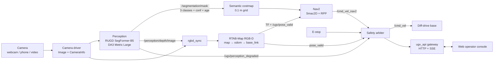

<div align="center">

# whoami

### Camera-primary autonomous navigation for GPS-denied outdoor UGVs

*One camera in, a safe `/cmd_vel` out. Point A to Point B with no GPS, where the vision model is a pluggable sensor and never the brain.*

[](https://docs.ros.org/)
[](https://docs.nav2.org/)
[](https://introlab.github.io/rtabmap/)
[](https://pytorch.org/)
[](https://docs.openvino.ai/)
[](ui/)
[](#-status)

<!-- TODO: replace with the hero GIF, e.g. docs/media/hero.gif -->


*Left: live camera with the Perception Port drawn over it. Right: the live depth scan as a rolling 3-D height map.*

### ▶ [Watch the demo video](#)  <!-- TODO: link the demo video -->

</div>

---

## Contents

- [What it is](#-what-it-is)
- [Design laws](#-design-laws)
- [Demo](#-demo)
- [Architecture](#-architecture)
- [The safety authority](#-the-safety-authority)
- [Perception Port](#-perception-port)
- [Tech stack](#-tech-stack)
- [System resource usage](#-system-resource-usage)
- [Status](#-status)
- [Getting started](#-getting-started)
- [Repository layout](#-repository-layout)
- [Team](#-team)
- [Credits](#-credits)

---

## 🎯 What it is

An installable **ROS 2** system that drives a differential-drive UGV from **Point A to Point B** in GPS-denied outdoor settings, using a calibrated camera as the primary sensor. It solves three problems:

| Challenge | How it is handled |
|---|---|
| **Path detection** | A pluggable perception *adapter* (RUGD SegFormer-B5 by default) publishes a canonical 3-class mask on a stable **Perception Port**, which is projected into a Nav2 costmap. |
| **Visual localization** | **RTAB-Map** in RGB-D mode, fed by the camera plus **Depth Anything 3 Metric Large** pseudo-depth. `mapping` mode builds a map; `localize` mode navigates on a saved one. |
| **Collision-aware navigation** | **Nav2** (Smac2D planner + Regulated Pure Pursuit) computes candidate motion. A **safety arbiter** has the final say on what reaches `/cmd_vel`. |

It runs from a live webcam, a phone camera streamed over a tunnel, or a recorded video replayed through the same live path, and comes with a web operator console that shows the camera, the mask, depth, the 3-D map and every safety signal in one place.

## 🧭 Design laws

The architecture is built around a few rules that do not bend:

1. **The brain is RTAB-Map + Nav2, not a CV model.** Segmentation models are *sources* behind a port. Swapping SegFormer for YOLOE or an ONNX model takes a remap YAML and a confidence profile, nothing else.
2. **Nav2 proposes, the safety authority decides.** One node owns `/cmd_vel`. E-stop, health failures, stale perception and invalid pose all beat the planner.
3. **Unknown is never free.** Pixels the model is unsure about become class `0` and are inflated, never driven through.
4. **Stale is not current.** Every mask carries stamp, frame, age and a valid flag. An old mask makes the whole field of view lethal and holds the robot.
5. **Geometry beats semantics.** If depth says "obstacle" and the mask says "traversable", the obstacle stays. A semantic "safe" never clears a geometric hazard.
6. **Sensor honesty.** A single camera with learned depth is the *minimum* tier. Drift and scale limits are documented, and losing visual odometry is a hold, not a guess.

## 🎬 Demo

<!-- TODO: replace each placehold.co image with a real screenshot/GIF and point each link at its clip -->

<table>
<tr>
<td width="33%">

**Camera view + mask**
[](#)
Live frame with the 3-class port (traversable / hazard / unknown) and freshness banners.

</td>
<td width="33%">

**Metric depth**
[](#)
Depth Anything 3 Metric Large on the same frame, the input to RTAB-Map's RGB-D odometry.

</td>
<td width="33%">

**Ground path preview**
[](#)
Flat-ground drivable-area preview built from the mask.

</td>
</tr>
<tr>
<td width="33%">

**3-D map view**
[](#)
Live depth cloud as a height heat map (blue low, red high), trajectory ribbon and Nav2 cost grid.

</td>
<td width="33%">

**Operator console**
[](#)
E-stop, mapping/localize mode, map-frame goals, health table and the final `/cmd_vel`.

</td>
<td width="33%">

**Phone camera + RC replay**
[](#)
A phone streaming 640x480 frames through a tunnel, or a recorded RC-car video replayed through the live path.

</td>
</tr>
</table>

## 🏗 Architecture



The camera fans out in parallel: perception never feeds pose, and RTAB-Map never reads the mask. Depth is the one bridge between them, published once by perception and consumed by SLAM.

Full contract: [`architecture.md`](architecture.md). Ownership per domain: [`dev.md`](dev.md). Decision log for SLAM, mapping and the camera paths: [`mindmap.md`](mindmap.md).

## 🛑 The safety authority

The arbiter is the only publisher on the base `/cmd_vel`. Highest priority wins:

| # | Condition | Result |
|---|---|---|
| 1 | E-stop / operator kill (latches across restarts) | zero twist |
| 2 | System health fail (timeout table below) | zero twist |
| 3 | Perception degraded, VO lost or pose invalid | zero twist (hold) |
| 4 | Nav2 controller output | commanded twist |

| Watch | Fails when |
|---|---|
| Camera | no image or image too old |
| Perception port | no valid, fresh mask |
| Localization | invalid pose, VO lost, TF missing |
| TF | required frames missing |
| Nav2 | crash or no controller heartbeat |
| E-stop | asserted |

## 🧩 Perception Port

Every adapter maps its own labels onto exactly three canonical classes, and normalizes its confidence into `[0, 1]` before any gate is applied.

| ID | Class | Costmap meaning |
|---|---|---|
| `0` | `unknown` | never free, inflated |
| `1` | `traversable` | free / low cost |
| `2` | `hazard` | lethal |

| Adapter | Role | Notes |
|---|---|---|
| **RUGD SegFormer-B5** | live default | 25 RUGD classes remapped to `{0,1,2}` |
| YOLOE-26s-seg | selectable, not live | OpenVINO only for now |
| Tutorial ONNX | eval only | regression scaffold |

The inference backend is picked at startup: **Intel OpenVINO GPU → NVIDIA CUDA → OpenVINO CPU**. DA3 and SegFormer run at FP32 on every backend.

## 🛠 Tech stack

| Layer | Choice |
|---|---|
| Middleware | ROS 2 **Lyrical Luth** (Docker on Windows, WSL2 for SLAM dev) |
| Localization / SLAM | RTAB-Map 0.23 RGB-D, `rgbd_odometry`, switchable `odom_source:=visual\|auto\|wheel` |
| Planning / control | Nav2 Smac2D + Regulated Pure Pursuit |
| Segmentation | RUGD SegFormer-B5 (`transformers`), YOLOE selectable |
| Depth | Depth Anything 3 Metric Large |
| Inference | PyTorch CUDA, OpenVINO 2026.4 (Intel Arc / CPU) |
| Safety | priority arbiter + timeout watchdog (`ugv_safety`) |
| Operator API | FastAPI gateway, Server-Sent Events, binary map format v1 |
| Operator UI | React 19, Vite, TypeScript, three.js, rosbridge (read-only) |
| CI | GitHub Actions for the gateway, platform and UI |

## 📊 System resource usage

<!-- TODO: fill in the measured numbers and add the chart -->

**Test machine:** `<CPU>` · `<GPU, VRAM>` · `<RAM>` · `<OS>` · camera `<640x480 @ N fps>`

<div align="center">

</div>

| Component | GPU util | VRAM | CPU | RAM | Rate |
|---|---|---|---|---|---|
| Perception (SegFormer-B5 + DA3) | `—` | `—` | `—` | `—` | `— Hz` |
| RTAB-Map + `rgbd_odometry` | `—` | `—` | `—` | `—` | `— Hz` |
| Nav2 + semantic costmap | `—` | `—` | `—` | `—` | `— Hz` |
| Safety arbiter + `ugv_api` | `—` | `—` | `—` | `—` | `— Hz` |
| Web console (browser) | `—` | `—` | `—` | `—` | `—` |
| **Whole stack** | `—` | `—` | `—` | `—` | `—` |

<details>
<summary>Reference: per-stage perception time from the first baseline (RTX 4060 laptop, FP32)</summary>

| Stage | Mean per frame |
|---|---|
| Segmentation cycle (decode, SegFormer, remap, gates) | 166.6 ms |
| DA3 forward pass | 159.5 ms |
| Depth post-processing (metres, resize, back-project) | 22.7 ms |
| Publish + cloud + decode | ~5 ms |

Segmentation and depth share one GPU serially, about 355 ms per frame in that run. Full notes: [`docs/mapping/baseline.md`](docs/mapping/baseline.md).

</details>

## 📋 Status

The full `live_cam` stack runs end to end and is now in **testing mode**.

| Area | State |
|---|---|
| Camera driver (webcam, phone tunnel, recorded video) | ✅ working |
| RUGD segmentation mask on live frames | ✅ working |
| DA3 metric depth → RTAB-Map RGB-D | ✅ wired |
| Semantic costmap (6 m ahead, ±4 m, stale mask → FOV lethal) | ✅ working |
| Nav2 Smac2D + RPP | ✅ launches; placeholder Jackal-class footprint |
| Safety arbiter, sole `/cmd_vel` owner | ✅ working |
| Operator console + 3-D map view | ✅ working |
| Phone calibration | ✅ RMS 0.35 px over 60 views |
| Elevation map | ⏸ deferred |
| `sim` and `bag` profiles | ⏳ not wired |
| Real robot footprints (primary + secondary) | ⏳ pending, gates any outdoor run |
| Outdoor run | ⏳ pending |

**Phase 0 go/no-go gate** (to be measured on a recorded moving loop): depth ≥ 5 Hz · `pose_valid` true ≥ 90 % while moving · VO lost < 5 % of frames · loop end error < 5 % of path length.

<details>
<summary>Known limits</summary>

- **Monocular scale wobble.** Depth comes from one camera through a learned model. Its scale varies between frames, so a wall seen twice can sit at two distances.
- **Unseen costmap cells are planned as free** so goals beyond the camera wedge stay reachable. Observed-but-unsure cells stay non-free and a stale mask still blocks the whole view.
- **Recorded-video replay is eval only.** Intrinsics and mount are guessed, so depth and map scale are not trusted and nothing moves.
- **No hardware run yet.** Everything above is the software stack on a laptop.

</details>

## 🚀 Getting started

**You need:** Windows with Git Bash and Docker Desktop, an NVIDIA GPU (CUDA) or Intel Arc (OpenVINO), Node.js for the console.

```bash
git clone https://github.com/NIGHTFURY609/whoami.git
cd whoami

# 1. Model weights (git never ships them)
cd turing
bash scripts/fetch_rugd_segformer.sh
bash scripts/fetch_da3metric_large.sh
# Intel only: export to OpenVINO IR
# .venv/bin/python scripts/export_rugd_segformer_openvino.py
# .venv/bin/python scripts/export_da3metric_openvino.py --height 336 --width 504
cd ..

# 2. Runtime image (ROS 2 Lyrical + Nav2 + RTAB-Map + CUDA PyTorch)
docker build -t ugv-lyrical-nav2 -f src/ugv_navigation/docker/lyrical-nav2.Dockerfile src/ugv_navigation/docker
docker build -t ugv-live -f ugv_nav/ugv_bringup/docker/live.Dockerfile ugv_nav/ugv_bringup/docker
# create the ugv-run container: see ugv_nav/ugv_bringup/README.md

# 3. Start everything (from Git Bash)
bash run.sh                              # laptop webcam
VIDEO=/path/to/clip.mp4 bash run.sh      # recorded video, eval only
PHONE=1 bash run.sh                      # phone camera through a Cloudflare tunnel
```

| Service | Address |
|---|---|
| Operator console | `http://localhost:5173` |
| API gateway | `http://localhost:8080` |
| rosbridge | `ws://localhost:9090` |
| Camera stream | `http://localhost:8090/cam.mjpg` |

Weights and backends in detail: [`user_manual.md`](user_manual.md). Current run notes: [`docs/status-report.md`](docs/status-report.md).

## 📁 Repository layout

```
turing/                    # Dev 1: perception (ugv_perception), adapters, remaps, weights, export scripts
ugv_nav/
├── ugv_localization/      # Dev 2: RTAB-Map, odom selector, pose validity
├── ugv_costmap/           # Dev 3: semantic costmap node
├── ugv_safety/            # Dev 5: safety arbiter + watchdog
├── ugv_bringup/           # Dev 5: launch profiles, camera driver, Docker, webcam/phone/video bridge
├── ugv_robot_description/ # Dev 5: URDF, camera mount
├── ugv_api/               # Dev 5: operator HTTP/SSE gateway
├── config/                # cameras (calibrations), safety
└── docs/                  # localization contracts, sensor honesty, conflicts
src/ugv_navigation/        # Dev 4: Nav2 config, behaviour tree, closed-loop tests
ui/                        # web operator console (camera view, map view, phone.html)
docs/                      # status report, mapping baseline and contract, plans
architecture.md            # the product contract (highest authority)
dev.md                     # work breakdown by functional domain
mindmap.md                 # SLAM / mapping decision log
run.sh                     # one-shot start of the whole stack
```

## 👥 Team

<!-- TODO: add names / GitHub handles -->

| Domain | Owns | Member |
|---|---|---|
| Dev 1 · Perception & vision | SegFormer / YOLOE / ONNX adapters, DA3 depth, Perception Port | `@handle` |
| Dev 2 · SLAM & localization | RTAB-Map, TF tree, pose validity, map products | `@handle` |
| Dev 3 · Costmaps & geometry | semantic costmap, geometry precedence | `@handle` |
| Dev 4 · Planning & control | Nav2 Smac2D + RPP, recoveries, `/navigate_to_pose` | `@handle` |
| Dev 5 · Safety & platform | safety arbiter, bringup, camera driver, gateway, UI | `@handle` |

## 📚 Credits

- [RTAB-Map](https://introlab.github.io/rtabmap/) and [Nav2](https://docs.nav2.org/)
- [Depth Anything 3](https://github.com/ByteDance-Seed/Depth-Anything-3) (`depth-anything/DA3METRIC-LARGE`, Apache 2.0)
- [RUGD SegFormer](https://huggingface.co/JasonTStanley/RUGD-Segformer), trained on the RUGD off-road dataset
- [Ultralytics YOLOE](https://docs.ultralytics.com/)

## 📄 License

<!-- TODO: add a LICENSE file and name it here -->
License to be added.
