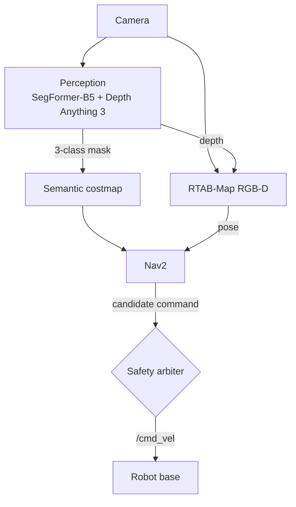

# whoami

**Camera-primary autonomous navigation for GPS-denied outdoor UGVs.**

One camera goes in and a safe `/cmd_vel` comes out. The robot drives from point A to point B with no GPS. The vision model is a pluggable sensor, never the brain.


<!-- TODO: hero GIF, e.g. docs/media/hero.gif -->


> [!NOTE]
> This is a software stack. So far it has run on a laptop with a webcam, a phone camera and a recorded RC-car video, not on a physical robot.

<br>

## At a glance

- **Sees** the path with a swappable segmentation model (RUGD SegFormer-B5 by default) and estimates metric depth with Depth Anything 3.
- **Localizes** with RTAB-Map in RGB-D mode, using camera frames plus that learned depth.
- **Plans and drives** with Nav2 (Smac2D planner, Regulated Pure Pursuit controller).
- **Stays safe** because one safety arbiter owns `/cmd_vel` and can stop everything, Nav2 included.
- **Shows everything** in a web console: live camera, mask, depth, a 3-D height map and every health signal.

<br>

## Demo

<!-- TODO: swap each placeholder for a real screenshot or GIF -->

| Camera view with mask | Metric depth |
|:---:|:---:|
|  |  |
| **3-D height map** | **Operator console** |
|  |  |

<br>

## How it works



1. **Camera.** A webcam, a phone streaming over a tunnel, or a recorded video. All three go through the same live path.
2. **Perception.** The segmentation model labels every pixel, then those labels are mapped to three classes: `traversable`, `hazard` or `unknown`. Depth Anything 3 turns the same frame into metric depth.
3. **Localization.** RTAB-Map uses camera and depth together to track the robot and build a map. It never reads the mask.
4. **Costmap and planning.** The mask is projected onto a 0.1 m grid in front of the robot, and Nav2 plans a path through it.
5. **Safety gate.** Nav2 only *proposes* a command. The arbiter decides whether it reaches the wheels.

Full contract in [`architecture.md`](architecture.md), team split in [`dev.md`](dev.md), decision log in [`mindmap.md`](mindmap.md).

<br>

## Rules the system never breaks

> [!IMPORTANT]
> - **Unknown is never free.** Pixels the model is unsure about are treated as blocked, not as open ground.
> - **Old data is not current data.** If the mask is too old, the whole camera view is marked lethal and the robot holds.
> - **Geometry beats labels.** If depth sees an obstacle, a "traversable" label cannot clear it.
> - **The model is not the brain.** Swapping the segmentation model takes a remap file and a confidence profile, nothing else.

**What stops the robot**, highest priority first:

| Priority | Trigger | Result |
|:---:|---|---|
| 1 | E-stop pressed | stop (stays latched across restarts) |
| 2 | Camera, perception, localization, TF or Nav2 times out | stop |
| 3 | Perception degraded or pose invalid | hold |
| 4 | Everything healthy | Nav2's command goes through |

<br>

## Built with

| | |
|---|---|
| **Robotics** | ROS 2 Lyrical Luth · RTAB-Map · Nav2 |
| **Vision** | RUGD SegFormer-B5 · Depth Anything 3 Metric Large · YOLOE (optional) |
| **Inference** | PyTorch on CUDA · OpenVINO on Intel Arc or CPU, picked automatically |
| **Console** | React 19 · TypeScript · Vite · three.js · FastAPI gateway |
| **Runtime** | Docker on Windows · GitHub Actions CI |

<br>

## Resource usage

<!-- TODO: add GPU / CPU / RAM usage screenshot, e.g. docs/media/resources.png -->


<sub>Measured on: `<GPU>` · `<CPU>` · `<RAM>`</sub>

<br>

## Status

- [x] Live camera input: webcam, phone over a tunnel, recorded video
- [x] Segmentation mask and metric depth on live frames
- [x] RTAB-Map localization on camera + depth
- [x] Semantic costmap and Nav2 planning
- [x] Safety arbiter as the only `/cmd_vel` publisher
- [x] Web console with camera view and 3-D map view
- [ ] Real robot footprints (Nav2 uses a placeholder for now)
- [ ] Simulation and rosbag profiles
- [ ] Elevation map (deferred)
- [ ] First outdoor run

> [!WARNING]
> **Known limits**
> - Depth from a single camera wobbles in scale from frame to frame, so the same wall can show up at two distances.
> - Recorded-video runs use guessed camera settings. Treat them as a demo, not a measurement.

<br>

## Getting started

**You need:** Windows with Git Bash and Docker Desktop, an NVIDIA GPU (or Intel Arc), and Node.js.

**1. Get the model weights.** Git doesn't include them.

```bash
git clone https://github.com/NIGHTFURY609/whoami.git
cd whoami/turing
bash scripts/fetch_rugd_segformer.sh
bash scripts/fetch_da3metric_large.sh
cd ..
```

On Intel, also export them to OpenVINO. See [`user_manual.md`](user_manual.md).

**2. Build the runtime image.**

```bash
docker build -t ugv-lyrical-nav2 -f src/ugv_navigation/docker/lyrical-nav2.Dockerfile src/ugv_navigation/docker
docker build -t ugv-live -f ugv_nav/ugv_bringup/docker/live.Dockerfile ugv_nav/ugv_bringup/docker
```

Then create the `ugv-run` container as described in [`ugv_nav/ugv_bringup/README.md`](ugv_nav/ugv_bringup/README.md).

**3. Run it** from Git Bash.

```bash
bash run.sh                          # laptop webcam
PHONE=1 bash run.sh                  # phone camera
VIDEO=/path/to/clip.mp4 bash run.sh  # recorded video
```

Open the console at **http://localhost:5173**.

<details>
<summary><b>Project structure</b></summary>

```
turing/               perception: segmentation, depth, Perception Port
ugv_nav/
  ugv_localization/   RTAB-Map, odometry, pose validity
  ugv_costmap/        semantic costmap
  ugv_safety/         safety arbiter and watchdog
  ugv_bringup/        launch files, camera driver, Docker
  ugv_api/            gateway for the console
src/ugv_navigation/   Nav2 setup and tests
ui/                   web console
docs/                 status report, mapping notes
```

</details>

<br>

## Team

<!-- TODO: add names / GitHub handles -->

| Area | Member |
|---|---|
| Perception and vision | `@handle` |
| SLAM and localization | `@handle` |
| Costmaps and geometry | `@handle` |
| Planning and control | `@handle` |
| Safety and platform | `@handle` |

## Credits

[RTAB-Map](https://introlab.github.io/rtabmap/) · [Nav2](https://docs.nav2.org/) · [Depth Anything 3](https://github.com/ByteDance-Seed/Depth-Anything-3) · [RUGD SegFormer](https://huggingface.co/JasonTStanley/RUGD-Segformer) · [Ultralytics YOLOE](https://docs.ultralytics.com/)

## License

<!-- TODO: add a LICENSE file and name it here -->
To be added.
